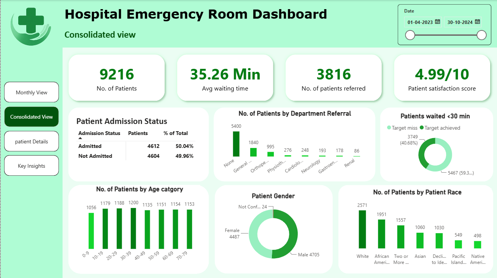
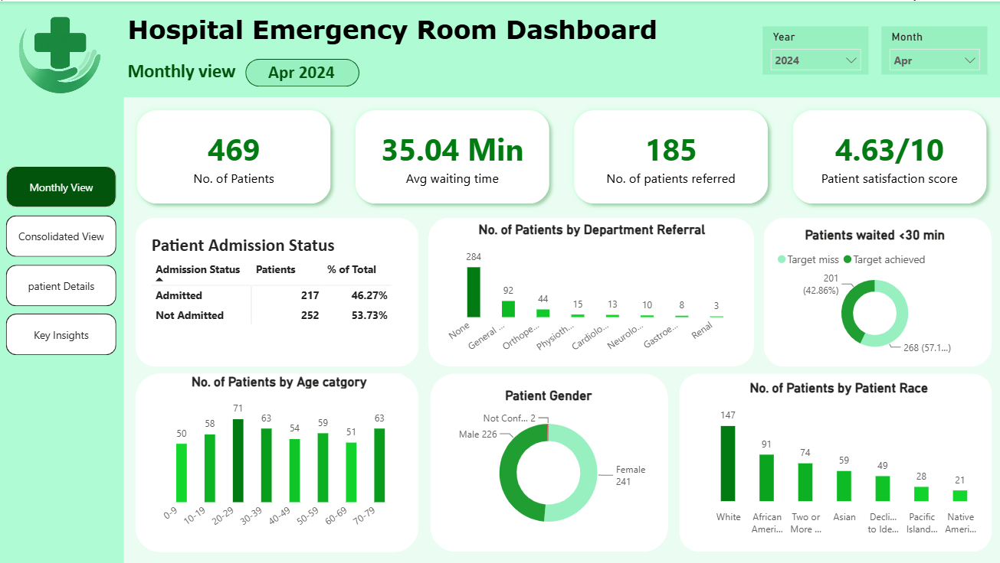
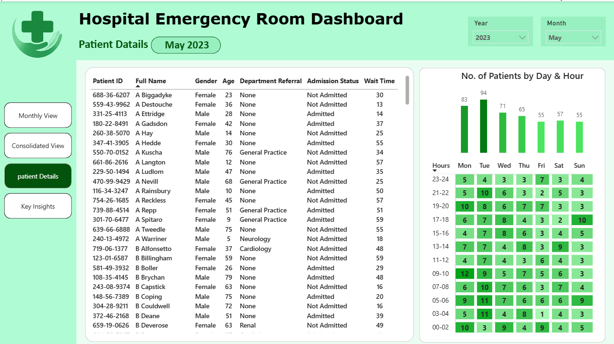
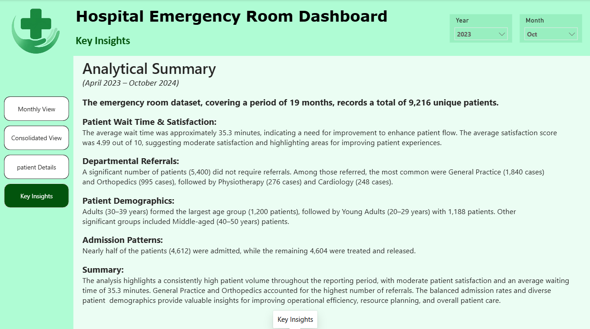

# Hospital Emergency Room Dashboard

An end-to-end Power BI project showcasing hospital emergency room analytics using Power Query, DAX, and data modeling to deliver interactive healthcare insights.

---

##  Project Overview

This Power BI dashboard analyzes hospital emergency room operations by providing insights into patient volume, waiting times, referrals, demographics, and admission trends. The report is designed to support data-driven decision-making through interactive visualizations and KPIs.

---

##  Objectives

- Analyze emergency room patient trends.
- Monitor average waiting time and patient satisfaction.
- Track patient admission status and department referrals.
- Analyze patient demographics.
- Identify peak admission hours.
- Enable interactive analysis using Month and Year filters.

---

## Dashboard Pages

### 1. Overview Dashboard
Displays key performance indicators and a summary of emergency room operations.

**KPIs**
- Total Patients
- Average Waiting Time
- Patient Satisfaction Score
- Total Referrals

---

### 2. Monthly Analysis
Provides month-wise insights into:
- Patient admissions
- Waiting time trends
- Referral patterns
- Patient flow

---

### 3. Patient Details
Detailed patient-level analysis including:
- Gender distribution
- Age group distribution
- Admission status
- Attendance status
- Department referrals

---

### 4. Insights
Summarizes important business insights and observations derived from the dashboard.

---

##  Tools & Technologies

- Power BI
- Power Query
- DAX
- Data Modeling

---

##  Data Preparation

The dataset was transformed using Power Query.

Data preparation included:
- Data cleaning
- Handling missing values
- Creating a Date Table
- Building table relationships
- Creating calculated columns
- Creating Age Groups
- Creating Admission Hour Intervals
- Developing DAX measures for KPIs

---

##  Dashboard Features

- Interactive KPI Cards
- Dynamic Charts
- Month & Year Slicers
- Multi-page Navigation
- Responsive Visualizations
- Data Model using Relationships

---

# Dashboard Preview

##  Consolidated view  of Dashboard

---

## Monthly Analysis

---

##  Patient Details

---

##  Key Takeaways

---

##  Skills Demonstrated

- Data Cleaning
- Data Transformation
- Data Modeling
- DAX Calculations
- Interactive Dashboard Design
- Business Intelligence
- Data Visualization

---

##  Author

**Abhijith P Anil**

